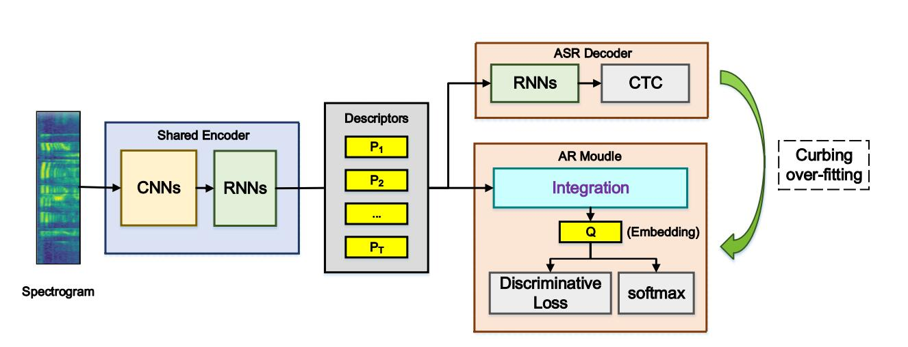
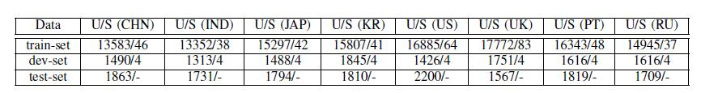
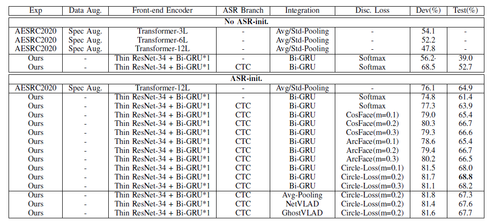
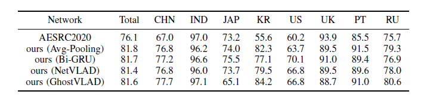
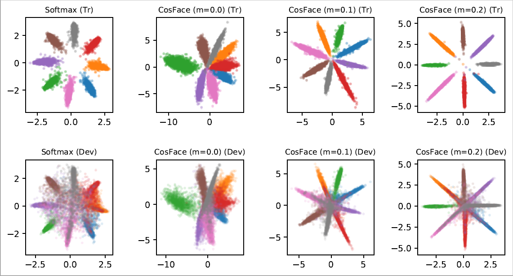
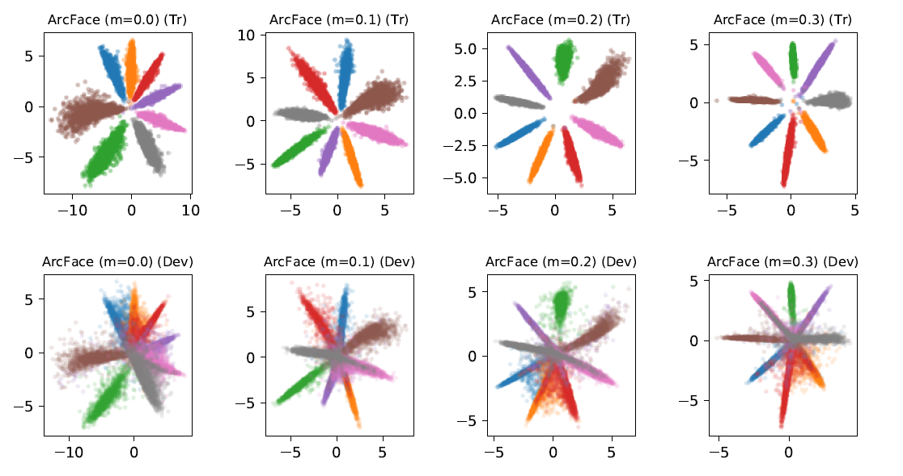
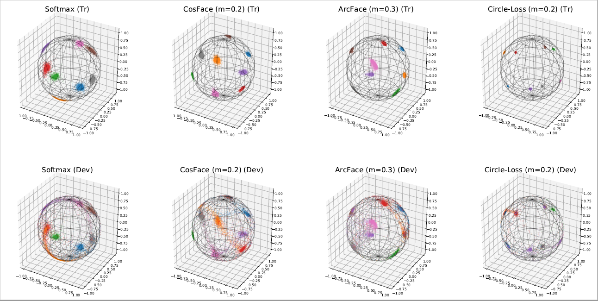

## SAR-Net: Speech Accent Recognition Network (Keras)
For Interspeech2020 Accented English Speech Recognition Challenges 2020 (AESRC2020)

##### Author: Ephemeroptera
##### Paper: https://arxiv.org/pdf/2011.12461.pdf
##### Date: 2020-09-25
##### Keywords: e2e, resnet, crnns, bigru, netvlad, cosface, arcface, circle-loss

##### 1. Abstract
This paper proposes an end-to-end deep network to recognize kinds of accents under the same language, where we develop
and transfer the deep architecture in speaker-recognition area to accent classification task for learning utterance-level accent
representation. Compared with the individual-level feature in speaker-recognition, accent recognition throws a more challenging
issue in acquiring compact group-level features for the speakers with the same accent, hence a good discriminative accent feature
space is desired. Our deep framework adopts multitask-learning mechanism and mainly consists of three modules: a shared CNNs
and RNNs based front-end encoder, a core accent recognition branch, and an auxiliary speech recognition branch, where we take
speech spectrogram as input. More specifically, with the sequential descriptors learned from a shared encoder, the accent recognition
branch first condenses all descriptors into an embedding vector, and then explores different discriminative loss functions which are
popular in face recognition domain to enhance embedding discrimination. Additionally, due to the accent is a speaking-related timbre,
adding speech recognition branch effectively curbs the over-fitting phenomenon in accent recognition during training. We show that
our network without any data-augment preproccessings is significantly ahead of the baseline system on the accent classification
track in the Accented English Speech Recognition Challenge 2020 (AESRC2020), where the state-of-the-art loss function Circle-Loss
achieves the best discriminative optimization for accent representation.

(you can view the baseline code proposed by AESRC2020: https://github.com/R1ckShi/AESRC2020)

##### 2. Environment
cudatoolkit==10.0
tensorlfow-gpu==1.13.1
keras==2.3.1

##### 3. Framework
We adopt CRNNs based front-end encoder, CTC based ASR branch, AR branch which has packaged feature-integration, discriminative losses and softmax based classifier:

Specially, in our code, the detailed configurations and options were:

    <Shared CRNNs encoder>: ResNet + Bi-GRU
    <Feature Integration>: (1) Avg-Pooling (2) Bi-GRU (3) NetVLAD (4) GhostVLAD
    <Discriminative Losses>: (1) Softmax (2) SphereFace (3) CosFace (4) ArcFace (5) Circle-Loss

    
##### 4. Accented Speech Data
The DataTang will provide participants with a total of 160 hours of English data collected from eight countries:
    	
    Chinese (CHN)
    Indian (IND)
    Japanese (JPN)
    Korean (KR)
    American (US)
    British (UK)
    Portuguese (PT)
    Russian (RU)
		
with about 20 hours of data for each accent, the detailed distribution about utterances and speakers (U/S) per accent was:

##### 5. Results
###### 5.1 Accent Recognition
The experimental results are divided into two parts according to whether the ASR pretraining task is used to initialize the encoder, then we conpare different integration methods and discriminative losses. Obviously, circle-loss possess the best discriminative optimization

Here, under the circle-loss, we gave the detailed accuracy for each accent:

###### 5.2 Visual embedding Accent Feature
In order to better demonstrate the discriminative optimization effect of different loss on accent features, we compress accent features into 2D/3D feature space.
The first row and the second row represented the accent features on the train-set and dev-set respectively.

(1) Softmax and CosFace (2D)

(2) ArcFace (2D)

(2) Softmax, CosFace, ArcFace, Circle-Loss (3D)

Welcome to fork and star ~
